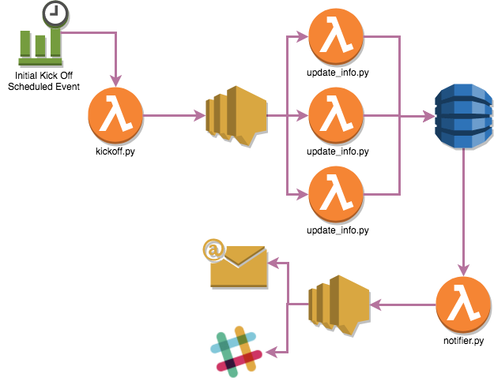

# GitHub Releases Serverless Notifier

## Description
I wanted to create a simple Serverless that interacted with [AWS Lambda](http://docs.aws.amazon.com/lambda/latest/dg/welcome.html) and [AWS DynamoDB](http://docs.aws.amazon.com/amazondynamodb/latest/developerguide/Introduction.html) to help me prepare for my AWS Associate exams.

I came up with the idea to periodocally check releases for specific GitHub projects, post this info into a DynamoDB table and then send out an email notification to subscribed users based on another schedule that includes that 
This is a set of simple AWS Lambda functions that are triggered by AWS Cloudwatch Scheduled events. 

## Architecture


## Usage
```shell
#---------- TESTING ----------#
## Test the function using SAM Local CLI
make run function_name=NAME_OF_FUNCTION_TO_TEST event_type=TYPE_OF_EVENT_TO_USE_WITH_FUNCTION

#---------- DEPLOYING ----------#
# Package the function for deployment with Cloudformation
make package bucket_name=NAME_OF_S3_BUCKET bucket_prefix=NAME_OF_BUCKET_DIRECTORY

# Deploy the function using Cloudformation
make deploy bucket_name=NAME_OF_S3_BUCKET bucket_prefix=NAME_OF_BUCKET_DIRECTORY stack_name=NAME_TO_USE_FOR_CLOUDFORMATION_STACK
```

## Requirements
- [SAM Local CLI](https://github.com/awslabs/aws-sam-local)
- [AWS CLI](http://docs.aws.amazon.com/cli/latest/userguide/installing.html)

## License
MIT

